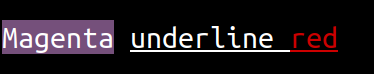
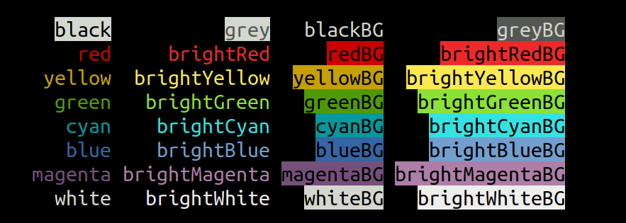
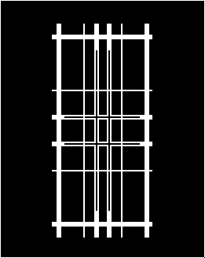
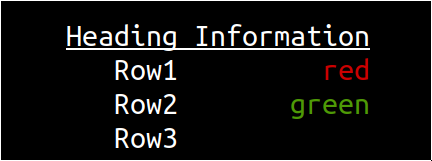

# Node Terminal Library

Formatting and keyboard input handling for the terminal in NodeJS.

```javascript
import { red, magentaBG } from "@dwbinns/terminal/colour";
import { underline } from "@dwbinns/terminal/format";
console.log(`${magentaBG("Magenta")} ${underline(`underline ${red("red")}`)}`);
```



## Installation

    npm install @dwbinns/terminal

Alternatively clone the git repository to try the examples:

    git clone https://github.com/dwbinns/terminal.git

## Notes

This library is ES module (import/export) only. CommonJS (require) is not supported.

Only ANSI compatible terminals are supported.

British English spelling is used (note the spelling of colour and grey).

## Colours

```javascript
import {red, redBG, rgb, rgbBG} from "@dwbinns/terminal/colour";
```

Functions to apply colouring to strings.

```javascript
red(text)
```
returns a string formatted red.

```javascript
redBG(text)
```
return a string formatted with a red background

All colours - colour palette varies by terminal type:



```javascript
rgb(red, green, blue)(text)
```
formats a string with the given colour. Red, green and blue should be numbers in the range 0 to 255
```javascript
rgbBG(red, green, blue)(text)
```
formats a string with a given background colour.

RGB colours will be rendered as 3 bit, 8 bit or 24 bit depending on terminal capabilites.


## Keyboard

```javascript
import {decodeKeys} from "@dwbinns/terminal/box"

async function * decodeKeys(stream)
```


An async generator which takes a stream and yields objects
describing keyboard events.

A stream which is passed in will be set to raw mode.

Alternatively any async iterable yielding buffers or strings may be supplied.

Each object may contain fields:
- text
- keyName
- shift
- alt
- ctrl

Not all keys are distinguishable, for example [ctrl]+[m] is the same as [return]. For some keys the modifiers (ctrl, shift, alt) cannot be determined.

```javascript
import { decodeKeys } from "@dwbinns/terminal/keyboard";
for await (let input of decodeKeys(process.stdin)) {
    console.log(input);
    if (input.keyName == "escape") break;
}
```

```javascript
{ text: '4', keyName: '4' }
{ keyName: 'pageup', shift: false, alt: true, ctrl: false }
{ keyName: 'tab', shift: true }
{ text: '8', keyName: '8' }
{ keyName: '*', alt: true }
```

## Box drawing characters

```javascript
import {box, rounded} from "@dwbinns/terminal/box"
box(up, right, down, left)
```

Returns a single box drawing character
where up, right, down and left represent the line styles in the specified direction and can be "none", "single", "double" or "heavy".

Limitations:
* "heavy" and "double" cannot be combined
* "single" and "double" cannot be combined on the same axis
If the limitations are not met then double will be replaced with heavy.

examples/box.js
```javascript
import { box } from "@dwbinns/terminal/box";
let lines = ["heavy", "none", "single", "double", "double", "single", "none", "heavy"];
for (let horizontal of lines) {
    for (let vertical of lines) {
        process.stdout.write(box(vertical, horizontal, vertical, horizontal));
    }
    process.stdout.write("\n");
}
```


    rounded(up, right, down, left)

Returns a single box drawing character with rounded corners where up, right, down and left can be "none" or "single"

## Format aware string functions

```javascript
import { visiblePadEnd, visibleSlice,  visiblePadStart} from "@dwbinns/terminal/string";
```

String functions that are aware of the visible length of the string, not including formatting characters.


```javascript
visiblePadEnd(string, length, fill)
```
Pad a string at the end to the specified visible length with the optional fill character.

```javascript
visiblePadEnd(string, length, fill)
```
Pad a string at the start to the specified visible length with the optional fill character.


```javascript
visibleLength(string)
```
Get the visible length of a string.

## Table formatting

```javascript
import table from "@dwbinns/terminal/table";
table(data, {header: false})
```

Format tables in aligned columns, even if cells contain formatting characters.

Data should be an array of rows each of which is an array of cells for that row.

The first row will be considered a header and underlined unless the header: false option is passed.

```javascript
import table from "@dwbinns/terminal/table";
import { red, green } from "@dwbinns/terminal/colour";

console.log(
    table(
        [
            ["Heading", "Information"],
            ["Row1", red("red")],
            ["Row2", green("green")],
        ]
    )
);
```




